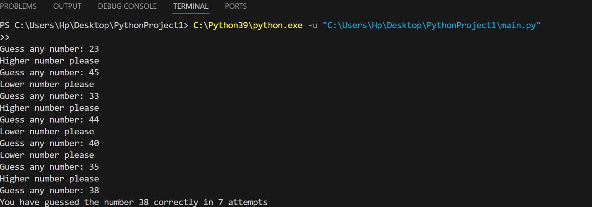

# 🎯 Perfect Guess Game 🎯

A simple number guessing game written in Python where the player tries to guess a randomly generated number in the least number of attempts.

## 🎮 How to Play  
1. The program selects a random number within a given range (e.g., 1 to 100).  
2. The player enters their guess.  
3. The program provides hints:  
   - 🔺 **Lower number please** – If the guess is greater than the number.  
   - 🔻 **Higher number please** – If the guess is smaller than the number.  
   - ✅ **Correct!** – If the player guesses the number.  
4. The game tracks the number of attempts and displays the score at the end.

## ✨ Features  
- Random number generation  
- User input validation  
- Hints for better gameplay  
- Tracks the number of attempts  

## 🖥️ Technologies Used
- Python 3
- Random module

## Screenshot
Here is a preview of the game running in the terminal:

